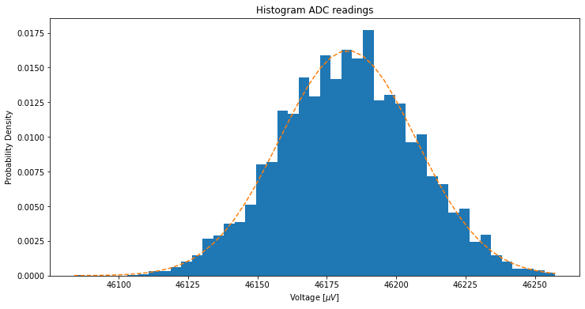
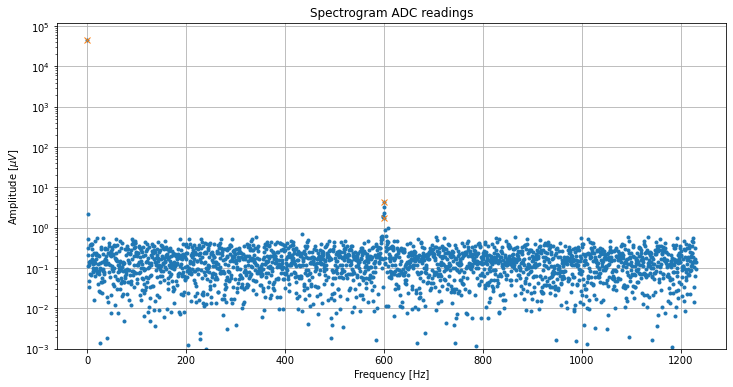

# NOTES

Here I will keep track of my notes of this project. 
E.g. this is a good place to list and describe de arguments to the adc streaming program.

## credits

This program is depends on and is derived from an great DMA example by:

Jeremy P Bentham, "Raspberry Pi ADC data streaming"

See https://iosoft.blog/streaming-analog-data-raspberry-pi for details.

So far this program has been tested on a RPI4 running Bullseye. However is should work on any RPI. I intend to test it on a RPI 0 and 3 as well. More later...

## compiling the program

Please do set your type of RPI (0..4) in the top of rpi_dma_utils.h:

``` c
// Raspberry Pi hardware version (0 to 4)
#define RPI_VERSION     4
```

Create the executable from the three files:
- rpi_adc-stream.c
- rpi_dma_utils.h
- rpi_dma_utils.c

with the following command:

```
gcc -Wall -g -o rpi_adc_stream rpi_adc_stream.c rpi_dma_utils.c
```

## pre-requisites

For this program to work correctly the the cpu frequency of the RPI needs to be fixed, as DMA is used to drive the SPI bus and GPIO. A varying RPI clock frequency will alter the timing of the SPI bus and GPIO signals that control the ADS1256.

for that you need to install the cpufrequtils if not already present:

```
sudo apt install cpufrequtils
```

The to set the RPI freq to it's lowest state run:

```
sudo cpufreq-set -g powersave
```

When you are done you can restore the RPI to it's default state with:

```
sudo cpufreq-set -g ondemand
```

## first test

in the directory run the command:

```
sudo ./rpi_adc_stream -t
```

The output should look like this:

```
RPi ADC streamer v0.30
VC mem handle 12, phys 0xbe3f5000, virt 0xb6f37000
frequency: 1886792, divider: 106 

ADS1256 register data:
STATUS 0x30 
MUX    0x01 
ADCON  0x20 
DRATE  0xF0 
IO     0xE1 
OFC0   0xF6 
OFC1   0x03 
OFC2   0x00 
FSC0   0x5E 
FSC1   0x0A 
FSC2   0x45 

Testing 1.887 MHz SPI frequency:   1.882 MHz
Testing  3267 Hz  PWM frequency: 3267.974 Hz
Closing
```
## basic usage

```
sudo rpi-adc_stream -f 1 -n 2 -v -s /tmp/adc.fifo
```
-f 1 = output timestamps
-n 2 = output 2 samples
-v   = show raw data received from the ADS1256
-s   = steam data to /tmp/adc.fifo

In a separate terminal you can view the output with

```
cat /tmp/adc.fifo
```

## command arguments

-t = Test mode

-b = ADC input buffer enabled. When omitted it goes to default = not enabled. 
The buffer will significantly increase the input impedance of the ADC and can be be modeled as a resistor.
The effective resistance depends on the data rate.
At data rates > 1000 S/s this is a minimum of about 10M $\Omega$, for data rates <= 50 S/s this is 80M $\Omega$.[<sup>1</sup>]

Test with ADC in series with 2 x 10MΩ 0.1% resisters and a 1.000 V voltage source. Below are the different median voltage readings for various settings of -d. The other relevant parameters were: -g 0, -b, -c 1

U2     = 2.500 V   
R1, R2 =  10e6 Ω (0.1%)  

R<sub>eff</sub>(U1)  =  U1/((U2-U1)/(R1+R2))  
R<sub>eff</sub> => (U1xR1 + U1xR2)/(U2 - U1)

data rate | U1 median  |  $\sigma$  | R<sub>eff</sub>
----------|------------|------------|----------------
-d = 11   | 2.010486 V | 0.000283 V | 82,142,124 Ω
-d =  9   | 2.009339 V | 0.000317 V | 81,903,350 Ω
-d =  7   | 1.682762 V | 0.000173 V | 41,181,687 Ω
-d =  5   | 1.264918 V | 0.000184 V | 20,483,142 Ω
-d =  3   | 0.853077 V | 0.000092 V | 10,359,646 Ω

### Inportant note
- When the buffer is enabled the voltage on any analog input should not exceed AGND or AVDD - 2 V with respect to AGND. This means for the WaveShare board 0..3V. Exceeding these limits will effect the ADC's performance, especially it's linearity[<sup>1</sup>].

- When the buffer in not enabled the voltage on any analog input should not exceed AGND -0.1 V and AVDD + 0.1 V with respect to AGND. 

-f 1 = enable time stamps, when omitted no time stamps are written to fifo. 1 is the only option.

-g [0..6] = Programmable Gain Amplifier (PGA) setting. 
0 = default. PGA is programmed in the lower 3 bits of the ADCON register of the ADC.

 Value | Binary | Gain  
-------|--------|------
 0 | 0b000 | 1 (default) 
 1 | 0b001 | 2            
 2 | 0b010 | 4            
 3 | 0b011 | 8  
 4 | 0b100 | 16 
 5 | 0b101 | 32 
 6 | 0b110 | 64
 7 | 0b111 | 64

-c [0..11] = ADC channel selector. Table for valid channel numbers

Value | Channel | Hex | Type
------|---------|-----|-----
 0 | D0 | 0x01 | differential (default)
 1 | D1 | 0x23 | differential
 2 | D2 | 0x45 | differential
 3 | D3 | 0x67 | differential
 4 | S0 | 0x08 | single-ended
 5 | S1 | 0x18 | single-ended
 6 | S2 | 0x28 | single-ended
 7 | S3 | 0x38 | single-ended
 8 | S4 | 0x48 | single-ended
 9 | S5 | 0x58 | single-ended
10 | S6 | 0x68 | single-ended
11 | S7 | 0x78 | single-ended

The current version can only handle a singe channel at a time.

-s = specifies the path and the name of the file to serve as the fifo buffer.

-n [0..4096]= number of samples per block. Normally this is 2 samples for a single channel. (This is due to nature of the SPI communications between the ADC and the Raspberry Pi: the spi interface receives and transmits at the same time. The clock is only active during tx, so to rx a byte you have to tx a byte. The communication with the AD1256 is aligned to 4 bytes, therefore each 'interaction' consists of 2x4 bytes where the first 4 bytes are 0x00 and 3 bytes containing the 3 byte value (2's complement), while the last byte = don't care and could be non-zero.)

-v = verbose output. Shows the byte values received from the ADS1256.

-d [0..15] = data rate. The number of samples per second. Table for valid data rate numbers

 Value | S/s |  Hex | Settling time in $\mu$ s    | Averaging | R<sub>eff</sub> 
-------|-----|------|-----------------------------|-----------|-------------------
0  | 30000 | 0xF0 | 210    | 1 (bypassed) default | 10 M $\Omega$ 
1  | 15000 | 0xE0 | 250    | 2       | 10 M $\Omega$
2  |  7500 | 0xD0 | 310    | 4       | 10 M $\Omega$
3  |  3750 | 0xC0 | 440    | 8       | 10 M $\Omega$
4  |  2000 | 0xB0 | 680    | 15      | 10 M $\Omega$
5  |  1000 | 0xA1 | 1180   | 30      | 20 M $\Omega$
6  |   500 | 0x92 | 2180   | 60      | 40 M $\Omega$
7  |   100 | 0x82 | 10180  | 300     | 40 M $\Omega$
8  |    60 | 0x72 | 16840  | 500     | 40 M $\Omega$
9  |    50 | 0x63 | 20180  | 600     | 80 M $\Omega$
10 |    30 | 0x53 | 33510  | 1000    | 80 M $\Omega$
11 |    25 | 0x43 | 40180  | 1200    | 80 M $\Omega$
12 |    15 | 0x33 | 66840  | 2000    | 80 M $\Omega$
13 |    10 | 0x23 | 100180 | 3000    | 80 M $\Omega$
14 |     5 | 0x13 | 200180 | 6000    | 80 M $\Omega$
15 |     2 | 0x03 | 400180 | 12000   | 80 M $\Omega$

The table above reflects the parameters of the ADC. The actual sample or data rate is in reality lower due to communication overhead.

## Tests with the BPW34(S)

The BPW34 is in series with the input terminals of the ADC. The buffer amplifier of the ADC needs to be enabled for this and is used as the series resistor for the BPW34. De pending on the data rate the effective resistance varies between 10M $\Omega$ and 80M $\Omega$. When testing the BPW34 is important to observe the limits imposed by the ADC. With this simple setup this means that the maximum reverse voltage is limited to a maximum of 3 volt. As can be concluded from the BPW34(S) data sheet[<sup>2</sup>],[<sup>5</sup>] the reverse voltage has no great influence on the sensitivity of the diode.

## I<sub>dark</sub>

Dark current single diodes.
(Reverse voltage 2.5 V, data rate = 11 (24 S/s))

 Diode  | U<sub>ADC</sub>  | I<sub>dark</sub>
--------|----|------------------
 1      |    |                  
 2      |    |                  
 3      |    |                  
 Array1 |    |                  
 Array2 |    |                    

## I<sub>light</sub>

Light current single diodes. 
(Reverse voltage 2.5 V, data rate = 11 (24 S/s), light source a green LED reflected of a white paper)

 Diode  | U<sub>ADC</sub>  | I<sub>light</sub> 
--------|----|------------------
 1      |    |                  
 2      |    |                  
 3      |    |                  
 Array1 |    |                  
 Array2 |    |                    


An alternative diode could be the SFH2401 as suggested on the Osram webpage[<sup>7</sup>] for the BPW34, as the Osram BPW34 is discontinued.
The SFH2401[<sup>6</sup>], is a SMD, has a similar sensitivity as the BPW34, but a smaller dark current, and a lower NEP.

The test do show a strong interference signal.

To eliminate the interference a differential setup was created: where the pin diodes arrays were connected in series to two high precisions 0.1% 10M $\Omega$ resistors[<sup>3</sup>] in a "Wheatstone Bridge" fashion[<sup>9</sup>]. A small reverse bias is applied. This bias of 2.5 V ensures that the ADC will always operate at maximum linearity.


The differential setup hopes to eliminate (common mode) interference as well as temperature drift. The original radiometer used the photodiodes in pv mode, this mode is not well documented and the data sheet (see Vishay BPW34[<sup>2</sup>]) shows a lower photo current for a similar illumination.

## Modeling the BPW34

A model BPW34 based on general information from these sources.[<sup>4</sup>]<sup>,</sup>[<sup>8</sup>]

## First test results with the photo-diode resistor bridge


## LTSpice simulation

Below is an example of a circuit that uses two diodes in the illuminated branch and two diodes in the dark branch. The effect of the additional photo current is reflected by the factor 2 in the current source. An attempt has been made to model the diode characteristics but this is still not very realistic. The simulation does demonstrate though that the temperature dependence of the photo current has been compensated by the bridge arrangement.


The R<sub>eff</sub> is changed in accordance with the R<sub>eff</sub> of the ADC. See tables above for the R<sub>eff</sub> relation to the sample rate.


For each value of R<sub>eff</sub> the illumination is varied form 0 to 2.5 lux (1V=1LUX)

Step | R<sub>eff</sub> | Plot color
-----|-----------------|-----------
@1   | 10M $\Omega$    | green
@2   | 20M $\Omega$    | blue
@3   | 40M $\Omega$    | red
@4   | 80M $\Omega$    | cyan

# A new round of lab testing the designed circuit

This is the diagram of the circuit implemented in the aluminum box, with the Raspberry Pi4 and the WaveShare high precision ADDA board:


Please note: the circuit around the green led has no purpose for the simulations, but is show here to describe the lab test setup.

The diode model for the BPW34 is not very accurate... but it will do for now. (As the circuit is balanced anyway, all the temperature drift stuff will not have an effect anyway, however I would like to get the capacitance and noise contribution accurate.)

Real lab test results:

Histogram example:



Spectrogram example:



Both plots were created with the data_analysis.ipynb

After the ADC was initialized with the rpi_adc_streaming command:
```
rpi_adc_streaming -n 2 -b -g 0 -c 0 -d 2 -s /tmp/adc.fifo
```
(2 samples per block, buffer enalbled, no gain, diff channel 0, data rate = 2463 S/s, streaming to /tmp/adc.fifo)

The data was then saved to the adc_data.csv, which is read by the data_analaysis.ipynb.

To time the measurement sessions (2 seconds) I used the following command (in a separate terminal):
```
timeout 2s cat /tmp/adc.fifo > /tmp/adc.data.csv
```

The signal generater for driving the led was setup as follows: 990mV DC offset with a 660mVpp AC at various frequencies.
In this test the led is a 3mm green led that is refelcted of a white sheet of paper on the underside of the lid of the alluminium box.
A liile shroud is place around the led to avoid direct light hittng the diodes.

To get an idea of the bandwidth of the system I created the following table:

freq [Hz] | ampl [$\mu V$] | comment
----------|----------------|--------
200  | 13.9 |
400  | 6.6  |
600  | 5.4  |
800  | 2.5  |
1000 | 2.7  |
1200 | 3.0  |
1400 | 3.9  | @ 1063 Hz
1600 | 3.6  | @  863 Hz
1800 | 1.4  | @  663 Hz
2000 | 2.3  | @  463 Hz
2200 | 1.0  | @  263 Hz

As you can see there is som aliasing happening... A filter is required.


[<sup>1</sup>]: https://www.ti.com/lit/ds/symlink/ads1256.pdf?ts=1666512818664&ref_url=https%253A%252F%252Fwww.ti.com%252Fproduct%252FADS1256

[<sup>2</sup>]: https://www.vishay.com/docs/81521/bpw34.pdf

[<sup>3</sup>]: https://docs.rs-online.com/cc04/0900766b81563867.pdf

[<sup>4</sup>]: http://www.osioptoelectronics.com/application-notes/AN-Photodiode-Parameters-Characteristics.pdf

[<sup>5</sup>]: https://dammedia.osram.info/media/resource/hires/osram-dam-5488305/BPW%2034_EN.pdf

[<sup>6</sup>]: https://dammedia.osram.info/media/resource/hires/osram-dam-6026228/SFH%202401_EN.pdf

[<sup>7</sup>]: https://www.osram.com/ecat/DIL%20BPW%2034%20B/com/en/class_pim_web_catalog_103489/prd_pim_device_2219537/

[<sup>8</sup>]: https://qtwork.tudelft.nl/~schouten/linkload/phdiode.pdf

[<sup>9</sup>]: https://www.ti.com/lit/an/sbaa532/sbaa532.pdf?ts=1670166223461&ref_url=https%253A%252F%252Fwww.google.com%252F


