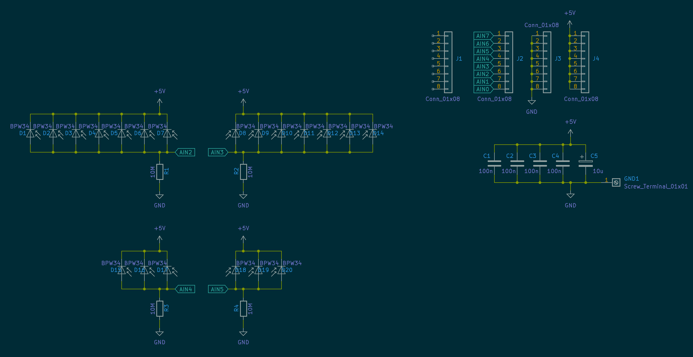
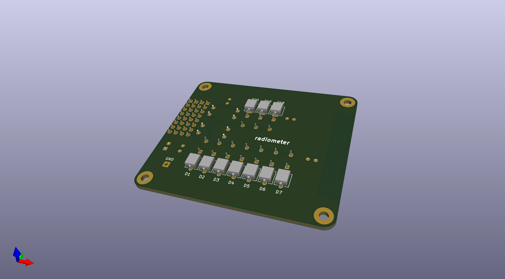
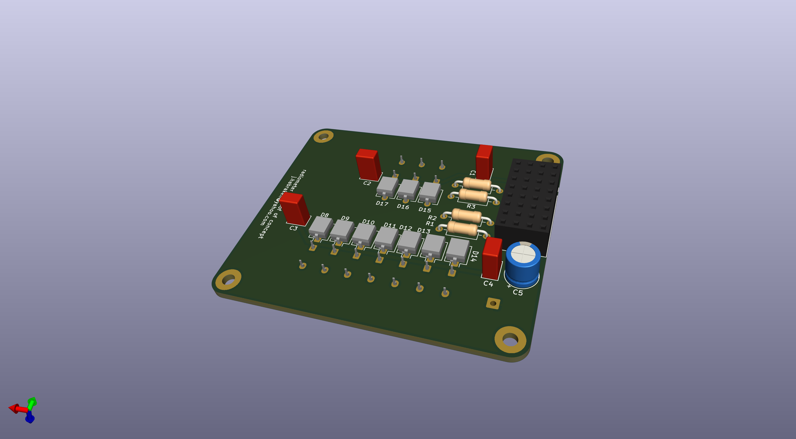

# radiometer_new

Notes specific to the radiometer_new

I will try to split the repository in two parts:
- WaveShare-ADS1256
- radiometer_new

## Description:

The WaveShare-ADS1256 part|folder will be just about the WaveShare board and specifically the ADS1256 ADC on that board.

The radiometer 'sub folder' will be used to migrate all the radiometer related info and files away from the WaveShare-ADS1256

## Schematic (concept & simulations) 

## Schematic (for the purpose of creating the pcb)

Schematic 

PCB top side

PCB bottom side

